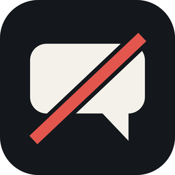
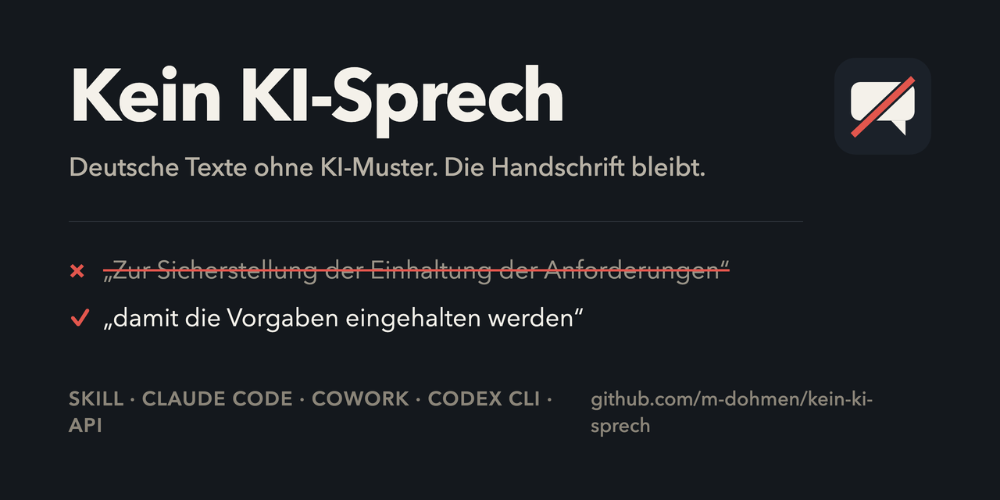

<br />

# Kein KI-Sprech

Ein Skill, der deutsche Texte von KI-Mustern befreit, ohne die Handschrift der schreibenden Person zu überschreiben.



Die englischsprachigen Vorbilder ([no-ai-slop](https://github.com/petergyang/no-ai-slop), [stop-slop](https://github.com/hardikpandya/stop-slop)) jagen englische Marker: Em-Dashes, Wh-Satzanfänge, „delve“, „leverage“. Im Deutschen fehlen die entweder oder sie sind korrekt. Der Halbgeviertstrich etwa gehört hier zum sauberen Satz. Dieser Skill ist deshalb für das Deutsche neu geschrieben.

## Schnellstart

Einmal klonen und das Paket bauen, danach die passende Umgebung wählen:

```bash
git clone https://github.com/m-dohmen/kein-ki-sprech.git
cd kein-ki-sprech
./scripts/build.sh
```

Das legt `dist/kein-ki-sprech.zip` an – ein Ordner `kein-ki-sprech/` mit `SKILL.md` und `references/beispiele.md`. Dieses ZIP ist die Installationsdatei für alle folgenden Wege.

| Umgebung | Installation | Aufruf |
| --- | --- | --- |
| Claude Cowork / claude.ai | ZIP unter *Customize > Skills* hochladen, danach einschalten | „Entferne den AI-Slop aus dem Text.“ |
| Codex CLI | ZIP nach `~/.agents/skills/` entpacken | `$kein-ki-sprech <Text>` |
| Claude Code | ZIP nach `~/.claude/skills/` entpacken | `/kein-ki-sprech <Text>` |
| Claude Projects | `SKILL.md` ins Projektwissen | „Entferne den AI-Slop aus dem Text.“ |
| API / eigene Anwendung | `SKILL.md` in den System-Prompt | – |

## Claude Cowork

Cowork und claude.ai teilen dieselbe Skill-Verwaltung. Einmal hochgeladen, gilt der Skill in beiden.

1. **Customize** in der linken Seitenleiste öffnen, Reiter **Skills**.
2. Auf **+** klicken, dann **Create skill** und **Upload skill** wählen.
3. `dist/kein-ki-sprech.zip` hochladen.
4. Den Schalter neben dem Skill einschalten – neu hochgeladene Skills sind zunächst aus.

Danach greift der Skill von selbst, sobald eine Anfrage passt:

- „Entferne den AI-Slop aus dem Absatz.“
- „Klingt der LinkedIn-Post nach ChatGPT? Nur prüfen, nicht umschreiben.“
- „Entfloskle den Angebotstext, aber lass die Vertragsformeln in Ruhe.“

Enthält das ZIP die Dateien flach statt im Ordner `kein-ki-sprech/`, lehnt Claude den Upload ab. `build.sh` packt den Ordner richtig mit. In Team- und Enterprise-Organisationen muss ein Owner eigene Skills zusätzlich erlauben. Kollegen laden dasselbe ZIP selbst hoch oder bekommen den Skill über *Share with organization*.

## Codex CLI

Codex liest Skills aus `.agents/skills`. Global für alle Repositories:

```bash
mkdir -p ~/.agents/skills && unzip -o dist/kein-ki-sprech.zip -d ~/.agents/skills/
```

Nur für ein Projekt – dann im Repository-Wurzelverzeichnis:

```bash
mkdir -p .agents/skills && unzip -o dist/kein-ki-sprech.zip -d .agents/skills/
```

Ergebnis in beiden Fällen: `…/.agents/skills/kein-ki-sprech/SKILL.md`.

Aufruf in einer Codex-Sitzung:

```
$kein-ki-sprech Bitte den folgenden Absatz überarbeiten: …
```

`/skills` listet die gefundenen Skills – damit prüfst du, ob die Installation gegriffen hat. Codex zieht den Skill auch ohne `$` heran, wenn die Aufgabe zur Beschreibung im Frontmatter passt. Abschalten ohne Löschen geht über einen `[[skills.config]]`-Eintrag in `~/.codex/config.toml`.

## Claude Code

```bash
mkdir -p ~/.claude/skills && unzip -o dist/kein-ki-sprech.zip -d ~/.claude/skills/
```

Für ein einzelnes Projekt statt global: nach `.claude/skills/` im Projektverzeichnis entpacken.

```
/kein-ki-sprech <Text>
```

Umgangssprachliche Formulierungen wie die Beispiele oben funktionieren auch hier.

## Claude Projects und API

**Claude Projects** – `SKILL.md` und `references/beispiele.md` in das Projektwissen hochladen.

**API oder eigene Anwendung** – den Inhalt von `SKILL.md` in den System-Prompt übernehmen. `references/beispiele.md` nur bei Bedarf nachladen.

## Was er findet

Vier Muster verraten maschinelles Deutsch am deutlichsten:

- **Nominalstil** – Substantivketten auf -ung/-heit/-keit. „Zur Sicherstellung der Einhaltung der Anforderungen“ wird zu „damit die Vorgaben eingehalten werden“.
- **Passiv mit verschwundenem Akteur** – „Es wurde entschieden“ verschweigt, wer entschieden hat.
- **Synonymkarussell** – der Deutschunterricht verbietet Wortwiederholung, Sprachmodelle setzen das brav um: dieselbe Sache heißt im Absatz Lösung, Tool, Anwendung, Plattform.
- **Beraterdenglisch und Übersetzungs-Slop** – „am Ende des Tages“, „Low Hanging Fruits“, „in 2026“, „nicht wirklich“.

Dazu gut zwei Dutzend Struktur- und Wortmuster: binäre Kontraste, Räuspern vorweg, Pseudo-Erkenntnisse, Doppelpunkt-Pointen, Deutungs-Anhängsel, Bedeutungs-Aufplusterung, vage Belege, Dreierfiguren, Konnektoren-Ketten, Reiseleiter-Sätze, Schein-Symmetrie, Fassaden-Verben, Metronom-Rhythmus, tiefsinnige Schlusssätze, Zusammenfassungs-Enden, Formatierungs-Slop.

## Was er stehen lässt

Nicht jede Förmlichkeit ist KI-Sprech. In Angeboten, Aufsichtsschreiben, Vorstandsvorlagen und Protokollen sind Siezen, feste Formeln, Passivkonstruktionen und Fachvokabular Teil der Gattung. Der Skill bestimmt erst die Textsorte, bevor er redigiert – Gattungsnormen schlagen jede Einzelregel. Ohne diese Regel würde er genau die Dokumente beschädigen, die in regulierten Branchen später geprüft werden.

Ebenso bleiben: die Stimme der schreibenden Person, klare Meinungen, Selbstironie, Abtönungspartikeln, Fachbegriffe, die die Zielgruppe kennt. Code, URLs, Zitate und Tabellenstruktur sind unantastbar. Und der Skill erfindet nichts: Fehlt eine Zahl oder eine Quelle, bleibt die Stelle stehen und wird als offene Angabe gemeldet.

## Zwei Modi

**Überarbeiten** (Standard) – kleinster wirksamer Eingriff, danach ein kurzer Abschnitt „Was geändert wurde“. Findet der Skill nichts, sagt er das – ein unveränderter Text ist ein gültiges Ergebnis.

**Prüfen** – Diagnose ohne Umschreiben, in festem Befundformat: jedes gefundene Muster benannt, die Stelle zitiert, die Korrektur in einem Satz. Kein Rätselraten darüber, ob eine KI den Text geschrieben hat. Detektoren raten, benannte Muster kann man nachprüfen.

Der Modus ergibt sich aus der Anfrage. „Nur prüfen, nicht umschreiben“ schaltet auf Prüfen; „prüfe und verbessere“ überarbeitet und benennt dabei jedes korrigierte Muster.

## Anpassen

Zwei Stellen lohnen sich, bevor der Skill im eigenen Haus verteilt wird:

1. **Die Wortliste** in `SKILL.md` um die Lieblingsfloskeln des eigenen Hauses ergänzen. Jede Marketingabteilung hat welche.
2. **Anrede** – der Skill duzt in seinen eigenen Kommentaren und wechselt ins Sie, wenn er gesiezt wird. Wer das anders will, ändert es im Abschnitt *Ablauf*.

Nach jeder Änderung `./scripts/build.sh` erneut laufen lassen und das ZIP neu hochladen oder entpacken.

## Aufbau

```
kein-ki-sprech/
├── SKILL.md                  # Regeln und Ablauf
├── references/
│   └── beispiele.md          # Vorher/Nachher-Paare
├── assets/
│   ├── icon.svg              # Quelle für das Icon
│   ├── icon-512.png          # Icon, 512 px
│   ├── icon-256.png          # Icon, 256 px (im README oben rechts)
│   ├── social.html           # Quelle für das Social Image
│   └── social.png            # Social Preview, 1280 × 640
└── scripts/
    ├── build.sh              # baut dist/kein-ki-sprech.zip (und .skill)
    └── build-assets.sh       # rendert die PNGs aus assets/
```

`dist/` ist nicht eingecheckt. `kein-ki-sprech.skill` ist eine identische Kopie des ZIP unter anderem Namen und liegt als Release-Artefakt bei; für den Upload in Cowork oder claude.ai die `.zip`-Variante nehmen.

Das Social Image trägt GitHub nicht automatisch ein: unter *Settings > General > Social preview* einmal `assets/social.png` hochladen. `build-assets.sh` baut Icon und Social Image neu und braucht dafür Google Chrome und ImageMagick.

## Herkunft

Deutsche Eigenentwicklung, angeregt von [no-ai-slop](https://github.com/petergyang/no-ai-slop) (Peter Yang) und [stop-slop](https://github.com/hardikpandya/stop-slop) (Hardik Pandya), beide MIT. Regeln, Wortlisten, Muster und Beispiele sind für das Deutsche neu geschrieben.

Bewusst nicht übernommen: das Em-Dash-Verbot (der Halbgeviertstrich ist im Deutschen korrekt, geregelt wird nur das Maß), das Pauschalverbot von Adverbien und W-Satzanfängen (englischspezifisch) und der Satire-Modus von no-ai-slop. Wer den Skill erweitert, sollte diese Regeln nicht nachrüsten.

## Mitmachen

Neue Muster, Falsch-Positive oder Vorher/Nachher-Paare: siehe [CONTRIBUTING.md](CONTRIBUTING.md). Für dieses Projekt gilt ein [Verhaltenskodex](CODE_OF_CONDUCT.md). Sicherheitsrelevante Funde bitte gemäß [SECURITY.md](SECURITY.md) melden.

## Lizenz

MIT
